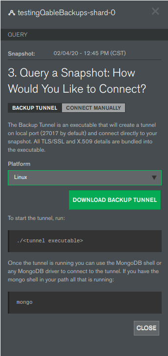

# Dockerfile for Querying a Continuous Backup

Dockerfile with `mongo` shell, `mongorestore` and `mongodump`. Runs the tunnel to perform queryable operations on a mongoDB Atlas continuous backup snapshot.

## Steps

- In Atlas, download tunnel file for the Linux platform. 

    
- Build docker image 
    - Note: Ensure the tunnel-*.tar.gz is in your current directory.
    - `docker build . -t qtunnel`
- Run container
    - Note: Mapped port to support connecting via driver/compass. These need to match.
    - `docker run --rm  -it -p 27017:27017 --hostname qtunnel qtunnel:latest`
    - Example output: 
        ```bash
        docker run --rm  -it -p 27017:27017   --hostname qtunnel qtunnel:latest 
        2020/02/04 23:02:50 Starting queryable backup tunnel v10.10.0 (e234ed07071bfe62a90b1673644f3e99c53c3907)
        2020/02/04 23:02:50 Tunnel Valid Until: 2020-02-05 19:11:02 +0000 UTC
        2020/02/04 23:02:50 Listening on localhost:27017
        ```
- View/restore documents
    - Get container id via `docker ps`
    - Log in to container via `docker exec -it CONTAINERID /bin/bash`
    - Run the `mongo` shell, `mongodump`, or `mongodump`| `mongorestore`
    - Example, 
    ```bash
        docker ps                             
        CONTAINER ID        IMAGE               COMMAND             CREATED             STATUS              PORTS                      NAMES
        716488dbd704        qtunnel:latest      "./tunnel"          8 minutes ago       Up 8 minutes        0.0.0.0:27017->27017/tcp   wizardly_pascal
       
       
        docker exec -it 716488dbd704 /bin/bash            
        root@qtunnel:~# mongo
        MongoDB shell version v4.2.3
        connecting to: mongodb://127.0.0.1:27017/?compressors=disabled&gssapiServiceName=mongodb
        Implicit session: session { "id" : UUID("6427a909-3239-4529-97de-ac3c2a4c438b") }
        MongoDB server version: 4.0.16
        WARNING: shell and server versions do not match
        Welcome to the MongoDB shell.
        For interactive help, type "help".
        For more comprehensive documentation, see
                http://docs.mongodb.org/
        Questions? Try the support group
                http://groups.google.com/group/mongodb-user
        MongoDB Enterprise > show dbs
        admin               0.000GB
        sample_airbnb       0.054GB
        sample_analytics    0.010GB
        sample_geospatial   0.001GB
        sample_mflix        0.043GB
        sample_supplies     0.001GB
        sample_training     0.069GB
        sample_weatherdata  0.005GB
        MongoDB Enterprise > use sample_mflix
        switched to db sample_mflix
        MongoDB Enterprise > show collections
        comments
        movies
        sessions
        theaters
        users
        MongoDB Enterprise > db.comments.findOne()
        {
                "_id" : ObjectId("5a9427648b0beebeb69579db"),
                "name" : "Olly",
                "email" : "brenock_o'connor@gameofthron.es",
                "movie_id" : ObjectId("573a1390f29313caabcd413b"),
                "text" : "Perspiciatis sit pariatur quas. Perferendis officia harum ipsum deleniti vel inventore. Nobis culpa eaque in blanditiis porro esse. Nisi deserunt culpa expedita dolorum quo aperiam.",
                "date" : ISODate("2005-01-04T13:49:05Z")
        }
        ```

## Testing

- This was tested on an M10 Atlas Cluster loaded with [Sample Data](https://docs.atlas.mongodb.com/sample-data/)


## References

- [MongoDB Docs](https://docs.atlas.mongodb.com/query-backup/#query-backup-use-tunnel-to-connect)